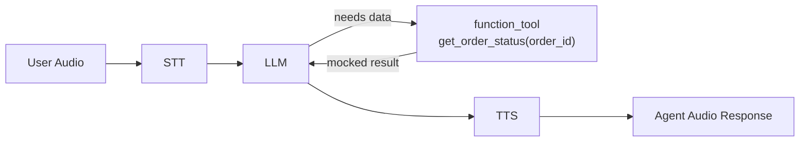
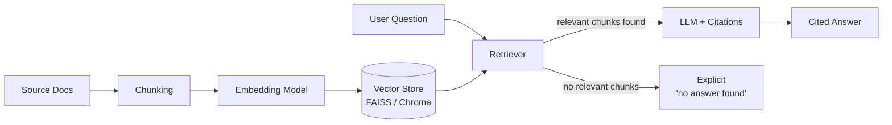
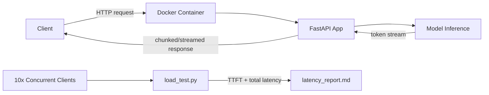

<div align="center">

# 🤖 Electro Pi — AI Engineer Technical Test

### Practical / Hands-on Assessment — Mid-Level AI Engineer

[](https://www.python.org/)
[](https://livekit.io/)
[](https://www.langchain.com/)
[](https://www.docker.com/)
[](https://fastapi.tiangolo.com/)
[](#-license)

**Candidate:** Rana Nasser &nbsp;|&nbsp; **Role:** AI Engineer (3+ yrs) &nbsp;|&nbsp; **Location:** Maadi, Cairo

</div>

---

## 📖 Project Overview

This repository is my complete solution to the Electro Pi AI Engineer take-home assessment. It's organized as **four independent, working mini-projects**, each mapped to a core skill from the job description rather than built as a theoretical exercise:

| # | Section | Skill Assessed |
|---|---------|-----------------|
| 1 | [LiveKit Agents](#1--section-1-livekit-agents-real-time-voice-ai) | Real-time voice AI, tool-calling, async pipelines |
| 2 | [LangChain / RAG](#2--section-2-langchain--rag) | Retrieval quality, hallucination guardrails, chain design |
| 3 | [Quantization](#3--section-3-quantization) | Hands-on quantization, precision/speed/quality trade-offs |
| 4 | [Model Deployment](#4--section-4-model-deployment) | Containerization, streaming, latency awareness |

Every section can be run independently and is designed to be reviewable within ~10 minutes of cloning.

---

## 🏗️ Repository Structure

```
.
├── README.md                        # This file
├── NOTES.md                         # Half-page write-up per section
│
├── section1_livekit_agent/
│   ├── agent.py
│   ├── requirements.txt
│   ├── transcript_example.log
│   └── README.md
│
├── section2_langchain_rag/
│   ├── docs/
│   ├── rag.py
│   ├── requirements.txt
│   ├── example_qa.md
│   └── README.md
│
├── section3_quantization/
│   ├── quantize_and_benchmark.py
│   ├── requirements.txt
│   ├── results/benchmark_table.md
│   └── README.md
│
└── section4_deployment/
    ├── app/main.py
    ├── Dockerfile
    ├── requirements.txt
    ├── load_test.py
    ├── results/latency_report.md
    └── README.md
```

---

## ⚙️ Installation

```bash
git clone <[repo-url](https://github.com/rananasser760/Electro_PI_Technical_Test.git)>
cd <Electro_PI_Technical_Test>
```

Each section has its **own** `requirements.txt` and is kept isolated on purpose — no shared global environment, so a reviewer can spin up only the section they want to check.

```bash
# Recommended: one virtual env per section
python -m venv .venv && source .venv/bin/activate   # or .venv\Scripts\activate on Windows
```

---

## 🚀 Quick Start

```bash
# 1) LiveKit voice agent
cd section1_livekit_agent && pip install -r requirements.txt &&  python agent.py dev

# 2) LangChain RAG pipeline
cd ../section2_langchain_rag && pip install -r requirements.txt && python demo.py

# 3) Quantization benchmark
cd ../section3_quantization && pip install -r requirements.txt && python quantize_and_benchmark.py

# 4) Deployment (containerized API)
cd ../section4_deployment
docker build -t ai-engineer-api .
docker run -p 8000:8000 ai-engineer-api
```

Where a step depends on external API keys or GPU access, that's called out explicitly in the section's own README, with a fallback/mock path so the logic can still be reviewed end-to-end without provisioning anything.

---

## 📂 Section Details

### 1 — 🎙️ Section 1: LiveKit Agents (Real-time Voice AI)

A minimal `AgentSession` pipeline (`STT → LLM → TTS`) built on `livekit-agents`. An `Agent` subclass carries a support-assistant persona and exposes a `@function_tool`-decorated `get_order_status(order_id)` method the LLM can call mid-conversation.

**Architecture:**



- **Providers used:** `[fill in — e.g. OpenAI Realtime for LLM, Deepgram STT, ElevenLabs TTS, or mocked text I/O]`
- **Proof of tool call:** `transcript_example.log`
- **Bonus (1.2):** provider swap demonstrated / explained in `section1_livekit_agent/README.md`

---

### 2 — 📚 Section 2: LangChain / RAG

A retrieval-augmented generation pipeline over `[fill in — e.g. 5 short markdown docs on X]`, chunked and embedded into a vector store, wired into a chain that cites its sources and explicitly refuses to answer when nothing relevant is retrieved.

**Architecture:**



- **Vector store:** `[fill in]`
- **Embedding model:** `[fill in]`
- **Example Q&A:** see [`section2_langchain_rag/example_qa.md`](./section2_langchain_rag/example_qa.md)

---

### 3 — 🧮 Section 3: Quantization

`[fill in model, e.g. Qwen2.5-1.5B]` run once at fp16/bf16 and once quantized (`[bitsandbytes 4-bit NF4 / GGUF]`), compared on the same 5 fixed prompts.

**📊 Benchmark Summary**

| Metric | Full Precision (fp16) | Quantized | Δ |
|---|---|---|---|
| Memory footprint | `[fill in]` | `[fill in]` | `[fill in]` |
| Tokens/sec | `[fill in]` | `[fill in]` | `[fill in]` |
| Qualitative quality (5 prompts) | `[fill in]` | `[fill in]` | `[fill in]` |

Full table with all 5 prompts and raw numbers: [`section3_quantization/results/benchmark_table.md`](./section3_quantization/results/benchmark_table.md)

---

### 4 — 🚢 Section 4: Model Deployment

The Section 3 model served behind `[FastAPI / vLLM]`, containerized, with a streaming endpoint and a concurrency load test.

**Architecture:**



**📈 Performance Benchmarks (10 concurrent requests)**

| Metric | Value |
|---|---|
| Time-to-first-token (avg) | `[fill in]` |
| Total latency (avg) | `[fill in]` |
| Throughput | `[fill in]` |

Full report: [`section4_deployment/results/latency_report.md`](./section4_deployment/results/latency_report.md)

---

## 🖼️ Screenshots

> Add demo screenshots / short recordings here to give reviewers a fast visual gut-check.

| Section | Screenshot |
|---|---|
| 1 — Voice agent tool call | `[screenshot/gif placeholder]` |
| 2 — RAG answer with citation | `[screenshot placeholder]` |
| 3 — Benchmark output | `[screenshot placeholder]` |
| 4 — API docs / load test output | `[screenshot placeholder]` |

---

## 📝 Run Instructions (Detailed)

Each `sectionX_.../README.md` contains section-specific setup, environment variables needed (if any), and expected output. The top-level [Quick Start](#-quick-start) above covers the fast path; use the per-section READMEs for troubleshooting or provider swaps.

---

## ⚠️ Assumptions & Limitations

- `[fill in — e.g. "STT/TTS in Section 1 are mocked with text I/O; the tool-calling logic itself is real and unmocked."]`
- `[fill in — e.g. "Embeddings in Section 2 use X instead of Y because Z."]`
- `[fill in — e.g. "Section 3 benchmarks were run on Google Colab T4 (free tier); numbers will vary on other hardware."]`
- `[fill in — e.g. "Section 4 load test uses N requests rather than a full production-scale run, given the take-home time budget."]`

Being explicit about trade-offs here is intentional — the assessment scores honesty about limitations, not the absence of them.

---

## 🔮 Future Improvements

- `[fill in — e.g. "Add hybrid search + re-ranking to the RAG pipeline for longer documents."]`
- `[fill in — e.g. "Add autoscaling/batching (vLLM continuous batching) for higher concurrency."]`
- `[fill in — e.g. "Add real barge-in/interruption handling to the voice agent."]`

---

## 📜 License

This project is submitted as a technical assessment for Electro Pi and is licensed under the [MIT License](./LICENSE) unless noted otherwise.

---

## 👩‍💻 Author

**Rana Nasser** — AI Engineer / CS Graduate, Ain Shams University
`[email: rananasser760@gmail.com / LinkedIn: https://www.linkedin.com/in/rana-nasser-7b2375291 / GitHub: https://github.com/rananasser760]`
