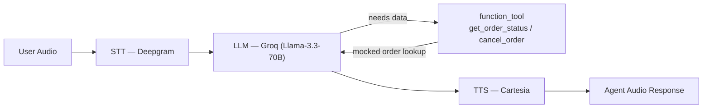
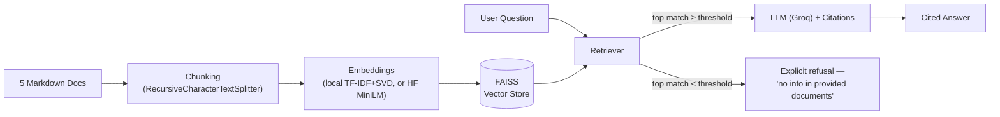
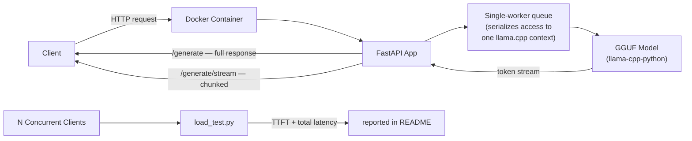

<div align="center">

# 🤖 Electro Pi — AI Engineer Technical Test

### Practical / Hands-on Assessment — Mid-Level AI Engineer

[](https://www.python.org/)
[](https://livekit.io/)
[](https://www.langchain.com/)
[](https://www.docker.com/)
[](https://fastapi.tiangolo.com/)
[](https://groq.com/)
[](#-license)

**Candidate:** Rana Nasser &nbsp;|&nbsp; **Role:** AI Engineer (3+ yrs) &nbsp;|&nbsp; **Location:** Maadi, Cairo

</div>

---

## 📖 Project Overview

This repository is my complete solution to the Electro Pi AI Engineer take-home assessment. It's organized as **four independent, working mini-projects**, each mapped to a core skill from the job description rather than built as a theoretical exercise:

| # | Section | Skill Assessed |
|---|---------|-----------------|
| 1 | [LiveKit Agents](https://github.com/rananasser760/Electro_PI_Technical_Test/tree/main/Section_1_LiveKit_Agents) | Real-time voice AI, tool-calling, async pipelines |
| 2 | [LangChain / RAG](#2--section-2-langchain--rag) | Retrieval quality, hallucination guardrails, chain design |
| 3 | [Quantization](#3--section-3-quantization) | Hands-on quantization, precision/speed/quality trade-offs |
| 4 | [Model Deployment](#4--section-4-model-deployment) | Containerization, streaming, latency awareness |

Every section can be run independently and is designed to be reviewable within ~10 minutes of cloning. Each section's own `README.md` also contains the required half-page write-up for that section, in place of a separate top-level notes file.

---

## 🏗️ Repository Structure

```
.
├── README.md                                # This file
│
├── section1_livekit_agent/
│   ├── agent.py                             # real livekit-agents pipeline (STT → LLM → TTS)
│   ├── agent_openrouter.py                  # Task 1.2 bonus: same agent, LLM swapped to OpenRouter
│   ├── console_demo.py                      # text-I/O demo harness (mock STT/TTS, real LLM + tool-calling)
│   ├── tools.py                             # shared tool implementations + JSON schemas
│   ├── sample_transcript.txt                # actual output of a console_demo.py run
│   ├── requirements.txt
│   └── README.md
│
├── section2_langchain_rag/
│   ├── documents/                           # 5 source markdown docs (food-delivery support domain)
│   ├── embeddings.py                        # pluggable embedding backends (local TF-IDF default)
│   ├── llm.py                               # Groq LLM + offline extractive fallback
│   ├── rag_pipeline.py                      # chunking, FAISS indexing, retrieval, citations, refusal logic
│   ├── demo.py                              # runs the fixed Q&A set, writes sample_answers.txt
│   ├── sample_answers.txt                   # actual output of a demo.py run
│   ├── requirements.txt
│   └── README.md
│
├── section3_quantization/
│   ├── models/
│   │   └── qwen2.5-1.5b-instruct-q4_k_m.gguf
│   ├── results/                             # fp16 / int4 / gguf result JSONs from actual runs
│   ├── benchmark.py                         # fp16 vs bitsandbytes int4 (Colab T4 GPU)
│   ├── gguf_benchmark.py                    # GGUF Q4_K_M via llama.cpp (CPU)
│   ├── compare.py                           # builds the trade-off table + side-by-side outputs
│   ├── download_model.py
│   ├── prompts.py                           # the 5 fixed prompts, shared across all three modes
│   ├── quantize_qwen2.5_1.5b.ipynb          # Colab notebook used for the fp16/int4 GPU runs
│   ├── requirements.txt
│   └── README.md
│
└── section4_deployment/
    ├── app/
    │   ├── __init__.py
    │   └── main.py                          # FastAPI service wrapping the Section 3 GGUF model
    ├── tests/
    │   ├── fake_llama_cpp.py                # stub for testing app logic without the real model
    │   └── test_app.py                      # integration tests (routing, streaming, concurrency)
    ├── load_test.py                         # concurrent load/latency test against a running instance
    ├── Dockerfile
    ├── .dockerignore
    ├── requirements.txt
    └── README.md
```

`section3_quantization/models/` and `section4_deployment/`'s expected model mount point point at the **same** `.gguf` file — Section 4 serves exactly the model quantized and benchmarked in Section 3, not a separate copy.

---

## ⚙️ Installation

```bash
git clone https://github.com/rananasser760/Electro_PI_Technical_Test.git
cd Electro_PI_Technical_Test
```

Each section has its **own** `requirements.txt` and is kept isolated on purpose — no shared global environment, so a reviewer can spin up only the section they want to check. (Section 3 and Section 4 do share one local virtual environment in my own setup, since Section 4 reuses the already-built `llama-cpp-python` install from Section 3's GGUF benchmark rather than rebuilding it from source a second time — see Section 4's README for that note.)

```bash
# Recommended: one virtual env per section
python -m venv .venv && source .venv/bin/activate   # or .venv\Scripts\activate on Windows
```

---

## 🚀 Quick Start

```bash
# 1) LiveKit voice agent
cd section1_livekit_agent && pip install -r requirements.txt
export GROQ_API_KEY=...           # console.groq.com, free
python console_demo.py            # text-I/O demo, no LiveKit server needed
# full voice pipeline (needs LiveKit Cloud + Deepgram + Cartesia keys):
python agent.py dev

# 2) LangChain RAG pipeline
cd ../section2_langchain_rag && pip install -r requirements.txt
export GROQ_API_KEY=...           # optional — offline extractive fallback works without it
python demo.py

# 3) Quantization benchmark
cd ../section3_quantization && pip install -r requirements.txt
python benchmark.py --mode fp16   # Colab T4 GPU
python benchmark.py --mode int4   # Colab T4 GPU
python gguf_benchmark.py models/qwen2.5-1.5b-instruct-q4_k_m.gguf   # CPU
python compare.py

# 4) Deployment (containerized API)
cd ../section4_deployment
docker build -t qwen-gguf-api .
docker run --rm -p 8000:8000 -v $(pwd)/../section3_quantization/models:/app/models qwen-gguf-api
```

Where a step depends on external API keys or GPU access, that's called out explicitly in the section's own README, with a fallback/mock path so the logic can still be reviewed end-to-end without provisioning anything.

---

## 📂 Section Details

### 1 — 🎙️ Section 1: LiveKit Agents (Real-time Voice AI)

A minimal `AgentSession` pipeline (`STT → LLM → TTS`) built on `livekit-agents`. An `Agent` subclass (`SupportAgent`) carries a food-delivery support persona and exposes two `@function_tool`-decorated methods the LLM can call mid-conversation: `get_order_status(order_id)` and `cancel_order(order_id, reason)`.

**Architecture:**


```mermaid
flowchart LR
    A[User Audio] --> B["STT — Deepgram"]
    B --> C["LLM — Groq (Llama-3.3-70B)"]
    C -->|needs data| D["function_tool\nget_order_status / cancel_order"]
    D -->|mocked order lookup| C
    C --> E["TTS — Cartesia"]
    E --> F[Agent Audio Response]
```

- **Providers used:** Deepgram (STT), Cartesia (TTS), Groq — Llama-3.3-70B-Versatile (LLM, OpenAI-compatible endpoint). `console_demo.py` mocks STT/TTS as plain text I/O so the tool-calling logic can be verified without a LiveKit server; `agent.py` is the real voice pipeline and was run end-to-end successfully against LiveKit Cloud + Deepgram + Cartesia + Groq.
- **Proof of tool call:** [`section1_livekit_agent/sample_transcript.txt`](./section1_livekit_agent/sample_transcript.txt) — a real `console_demo.py` run showing `get_order_status` and `cancel_order` both being invoked mid-conversation, including one genuine simulated tool failure handled gracefully.
- **Bonus (1.2):** provider swap demonstrated concretely in [`agent_openrouter.py`](./section1_livekit_agent/agent_openrouter.py) — identical agent, only the `llm=` block changed from Groq to OpenRouter (same OpenAI-compatible interface). STT/TTS swap (e.g. Deepgram↔AssemblyAI, Cartesia↔ElevenLabs) is shown as code snippets in the section README.

---

### 2 — 📚 Section 2: LangChain / RAG

A retrieval-augmented generation pipeline over 5 short markdown docs I wrote myself (food-delivery support domain — refund policy, delivery times, account security, driver tips, FAQ), chunked and embedded into a vector store, wired into a chain that cites its sources and explicitly refuses to answer when nothing relevant is retrieved.

**Architecture:**


```mermaid
flowchart LR
    A[5 Markdown Docs] --> B["Chunking\n(RecursiveCharacterTextSplitter)"]
    B --> C["Embeddings\n(local TF-IDF+SVD, or HF MiniLM)"]
    C --> D[("FAISS\nVector Store")]
    E[User Question] --> F[Retriever]
    D --> F
    F -->|top match ≥ threshold| G["LLM (Groq) + Citations"]
    F -->|top match < threshold| H["Explicit refusal —\n'no info in provided documents'"]
    G --> I[Cited Answer]
```

- **Vector store:** FAISS (`langchain_community.vectorstores.FAISS`)
- **Embedding model:** local TF-IDF + SVD (scikit-learn) by default — no API key or model download needed, so the pipeline runs fully offline; swappable for real neural embeddings (`sentence-transformers/all-MiniLM-L6-v2`) via `USE_HF_EMBEDDINGS=1` with no other code changes
- **Example Q&A:** see [`section2_langchain_rag/sample_answers.txt`](./section2_langchain_rag/sample_answers.txt) — includes 3 correctly-cited in-domain answers plus one deliberately out-of-scope question ("best way to bake a chocolate lava cake?"), which the pipeline correctly refuses instead of hallucinating

---

### 3 — 🧮 Section 3: Quantization

`Qwen/Qwen2.5-1.5B-Instruct` run once at fp16 and once quantized two different ways — **bitsandbytes 4-bit NF4** (on a free Google Colab T4 GPU) and **GGUF Q4_K_M** via llama.cpp (CPU) — compared on the same 5 fixed prompts.

**📊 Benchmark Summary**

| Metric | FP16 (GPU) | INT4 / NF4 (GPU) | GGUF Q4_K_M (CPU) |
|---|---|---|---|
| Peak memory | 3.107 GB (VRAM) | 1.222 GB (VRAM) — ↓ 60.7% | 1.117 GB (disk / RAM) |
| Avg throughput | 22.42 tok/s | 11.29 tok/s — ↓ 49.6% (slower, not faster) | 11.42 tok/s (on CPU) |
| Qualitative quality | Baseline | Minimal degradation on most prompts; noticeably less idiomatic French translation | Comparable to FP16 on the same translation prompt |

The counterintuitive result worth flagging: NF4 quantization here is a clear **memory** win but not a **speed** win — bitsandbytes' runtime dequantization overhead makes it ~2x slower than fp16 on a model this small, which is exactly the kind of thing worth measuring rather than assuming.

Full tables (including the per-prompt breakdown and the qualitative side-by-side): [`section3_quantization/README.md`](./section3_quantization/README.md)

---

### 4 — 🚢 Section 4: Model Deployment

The exact Section 3 GGUF model served behind **FastAPI + llama-cpp-python** (justification: vLLM/TGI target batched GPU inference and don't support GGUF at all — this deployment target is deliberately CPU/GGUF, so a GPU-batching server doesn't fit), containerized, with a token-by-token streaming endpoint and a concurrency load test.

**Architecture:**


```mermaid
flowchart LR
    A[Client] -->|HTTP request| B[Docker Container]
    B --> C[FastAPI App]
    C --> D["Single-worker queue\n(serializes access to\none llama.cpp context)"]
    D --> E["GGUF Model\n(llama-cpp-python)"]
    E -->|token stream| C
    C -->|/generate — full response| A
    C -->|/generate/stream — chunked| A
    F[N Concurrent Clients] --> G[load_test.py]
    G -->|TTFT + total latency| H[reported in README]
```

- **App logic verified:** `tests/test_app.py` runs 4 integration tests against a stub of `llama_cpp.Llama` (`tests/fake_llama_cpp.py`) — routing, streaming, and the single-worker request-queueing behavior all pass, independent of the real model build.
- **Load test:** `load_test.py` measures time-to-first-token and total latency for 10 concurrent requests against a live running instance — see [`section4_deployment/README.md`](./section4_deployment/README.md) for the exact run steps and current results status.
- **Write-up:** scaling to 50 concurrent users (horizontal scaling, moving to GPU + continuous batching, backpressure-aware queueing, caching, autoscaling) is in the section README.

---

## ⚠️ Assumptions & Limitations

- **Section 1:** the full voice pipeline (`agent.py`) requires a LiveKit Cloud project plus Deepgram and Cartesia keys and was run and confirmed working end-to-end; `console_demo.py` is a separate, always-runnable path where STT/TTS are mocked as text I/O (as explicitly permitted by the assignment) so the tool-calling logic is reviewable with zero external setup.
- **Section 2:** the default embedding backend is a local TF-IDF+SVD method, not a neural embedding model — chosen so the pipeline needs no API key or model download to run. This has a real, documented limitation: on a small corpus, lexically-overlapping-but-off-topic questions can score a deceptively high similarity (e.g. a generic question sharing a common word with the docs). The relevance threshold was tuned against a small evaluation set of questions, not a large one — see the section README's write-up for how hybrid search + re-ranking would address this on longer, more realistic document sets.
- **Section 3:** fp16 and int4 benchmarks were run on a free Google Colab T4 GPU; the GGUF benchmark was run separately on CPU. Numbers will vary on different hardware, and GPU vs CPU memory figures aren't directly comparable (VRAM vs disk/RAM footprint) — the README is explicit about this distinction rather than presenting one merged number.
- **Section 4:** the API currently serializes all generation through a single worker thread against one CPU model instance — correct and honest for a small-scale demo, but not how this would be scaled to real concurrent production traffic (see the write-up for what changes at 50 concurrent users).

Being explicit about trade-offs here is intentional — the assessment scores honesty about limitations, not the absence of them.

---

## 🔮 Future Improvements

- Add hybrid search (dense + BM25) and a cross-encoder re-ranker to the RAG pipeline, particularly for longer, more overlapping documents than the current 5-doc demo set.
- Move Section 4 to GPU + GPTQ/AWQ + vLLM/TGI with continuous batching once concurrent load moves from occasional spikes to a sustained requirement, per the Section 4 write-up.
- Add real barge-in / interruption handling to the voice agent (VAD-triggered TTS cancellation and history truncation, per the Section 1 write-up).
- Swap Section 2's default TF-IDF embeddings for real neural embeddings (`USE_HF_EMBEDDINGS=1`) once network access to Hugging Face is available in the target environment, for more robust retrieval on ambiguous queries.

---

## 📜 License

This project is submitted as a technical assessment for Electro Pi and is licensed under the [MIT License](./LICENSE) unless noted otherwise.

---

## 👩‍💻 Author

**Rana Nasser** — AI Engineer / CS Graduate, Ain Shams University
Email: rananasser760@gmail.com &nbsp;|&nbsp; LinkedIn: [rana-nasser-7b2375291](https://www.linkedin.com/in/rana-nasser-7b2375291) &nbsp;|&nbsp; GitHub: [rananasser760](https://github.com/rananasser760)
